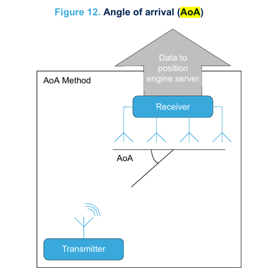
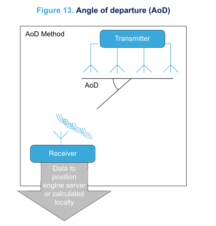

### 测向功能

经典的定位应用（如接近检测、信标等）基于蓝牙低能耗（Bluetooth® LE）信号的接收信号强度（RSSI）测量。这种方法确定两个设备是否在彼此的范围内，并估算相关的距离。

蓝牙规格版本5.1定义了一种新功能，能够高精度地识别接收到的蓝牙LE数据包的方向。此功能有两种方法：
1. 到达角（AoA）
2. 发射角（AoD）

这两种方法都要求两个通信设备之一具备多个天线的阵列（在接收设备中使用AoA，在发射设备中使用AoD）。

#### 基于到达角（AoA）的测向

在AoA方法中，发射器（标签）设备发送一个方向测量信号，使用单个天线。接收器设备（定位器）具有多个天线阵列，通过检测信号的相位差来识别方向，这一差异源于每个天线到发射天线的距离不同。接收器设备在切换阵列中活跃的天线时，获取信号的IQ样本数据。接收器能够通过特定算法对IQ样本数据进行处理，从而计算相对信号方向。

该功能允许多个应用场景得到满足，例如实时资产跟踪。



在接收器（定位器）设备上，需要一个天线阵列，并且计算多个标签的角度需要相应的处理能力。发射器（标签）设备只需要一个天线，并且必须具备发送所需信息的能力，以便进行IQ数据采样。

#### 基于发射角（AoD）的测向

在AoD方法中，发射器设备（通常是锚点设备）发送一个特殊的方向测量信号，使用天线阵列。接收器设备（例如移动电话）则只需要一个单天线。

当来自发射设备的多个信号穿过接收设备的阵列天线时，接收设备会获取IQ样本。接收器能够通过特定算法处理IQ样本，从而计算相对信号方向。

该功能允许满足多个应用场景，例如室内定位系统。



发射器设备需要通过天线阵列发送多天线定位信号，并且必须具备发送所需信息的能力，以便进行IQ数据采样。接收器设备只需要一个天线，而接收信号的角度计算可能需要浮点处理单元（FPU）及一些内存资源。

#### 同相位和正交（IQ）

测向使用同相位和正交（IQ）采样来测量在特定时间点入射到天线的无线电波的相位。在AoA方法中，采样过程在阵列的每个天线上一一进行，按照阵列设计的特定顺序。

采样数据随后通过主机控制器接口（HCI）提供给主机。IQ样本应与一些特定算法一起使用，以计算入射波的角度。这些算法并未在蓝牙LE核心规范中定义。

IQ采样过程在链路层（LL）和主机控制器接口（HCI）层面涉及了一些更改。在链路层级，增加了一个称为“常频扩展”的新字段到LL数据包中。该字段提供一个常频信号，作为IQ采样的参考。此字段包含一系列1，并未经过加扰处理，也不用于CRC计算。

常频扩展可以用于连接无关和连接相关的场景：
1. 连接无关使用：需要周期性广告特性（因为采样过程中的确定性时序非常重要），且CTE附加到AUX_SYNC_IND PDUs中。
2. 连接相关使用：定义了新的PDUs LL_CTE_REQ和LL_CTE_RSP。

[pm0274.pdf 28 - 30](pm0274-bluetooth-low-energy-stack-v4x-programming-guidelines-stmicroelectronics.pdf)

---
---

### 测向命令和事件

STM32WB09xE和STM32WB05xZ设备支持测向功能的两种方法（到达角和发射角），并通过以下方式进行管理：
- 数据包内的常频扩展（CTE）
- AoA和AoD的天线切换机制。

STM32WB09xE和STM32WB05xZ能够在链路层数据包中附加一个新字段，称为常频扩展：该字段提供一个常频信号，用于执行IQ采样，符合蓝牙核心规范v5.1。

为了支持测向功能，控制器需要支持天线切换。STM32WB09xE和STM32WB05xZ能够通过一个名为ANTENNA_ID的控制信号控制外部天线开关。该信号是一个7位天线标识符（ANTENNA_ID[6:0]），指示在某个时间槽中使用的天线编号，并由内部序列器实时提供。由于ANTENNA_ID[6:0]是一个7位的标识符，所以他最多能表达 \(2^7 = 128\) 个天线编号。

在AoD发射器或AoA接收器中，收发器在数据包的CTE字段期间需要切换天线。为此，可以通过在关联的备用功能中编程，启用某些I/O上的ANTENNA_ID信号。软件开发工具包中提供了一个特定命令 `aci_hal_set_antenna_switch_parameters()`，以便更方便地执行适当的ANTENNA_ID信号配置。

该信号需要提供给外部天线切换电路，其中ANTENNA_ID[0]是最不重要的位，而ANTENNA_ID[6]是最重要的位。要使用的I/O是具有ANTENNA_ID备用功能的引脚（即PB0到PB6）。

蓝牙核心规范v5.1定义了新的HCI命令和事件，以控制常频扩展和IQ采样。特别是，天线切换模式由以下HCI命令的Antenna_IDs参数控制：
- `hci_le_set_connectionless_cte_transmit_parameters()`
- `hci_le_set_connectionless_iq_sampling_enable()`
- `hci_le_set_connection_cte_transmit_parameters()`
- `hci_le_set_connection_cte_receive_parameters()`

在模式中指定的每个天线ID对应于STM32WB0设备内部序列器生成的ANTENNA_ID编号，该编号通过PB[6:0]发送。

表70：测向命令和事件提供了处理具有适当CTE信息的数据包传输和接收的HCI命令和事件列表。这些命令允许配置多个CTE方面，如下所示：
- CTE长度
- CTE类型
- 天线切换模式的长度
- 天线ID
- 时隙持续时间
[关于这些方面的解析](多个CTE方面.md)  


表70：测向命令和事件

```c
//返回值                             函数和参数                          
tBleStatus aci_hal_set_antenna_switch_parameters(uint8_t Antenna_IDs, uint8_t Antenna_ID_Shift, uint8_t Default_Antenna_ID, uint8_t RF_Activity_Enable)
//
tBleStatus hci_le_set_connectionless_cte_transmit_parameters (uint8_t Advertising_Handle, uint8_t CTE_Length, uint8_t CTE_Type, uint8_t CTE_Count, uint8_t Switching_Pattern_Length, uint8_t Antenna_IDs[])
//
tBleStatus hci_le_set_connectionless_cte_transmit_enable(uint8_t Advertising_Handle, uint8_t CTE_Enable)
//
tBleStatus hci_le_set_connectionless_iq_sampling_enable (uint16_t Sync_Handle, uint8_t Sampling_Enable, uint8_t Slot_Durations, uint8_t Max_Sampled_CTEs, uint8_t Switching_Pattern_Length, uint8_t Antenna_IDs[])
//
tBleStatus hci_le_set_connection_cte_receive_parameters (uint16_t Connection_Handle, uint8_t Sampling_Enable, uint8_t Slot_Durations, uint8_t Switching_Pattern_Length, uint8_t Antenna_IDs[])
//
tBleStatus hci_le_set_connection_cte_transmit_parameters (uint16_t Connection_Handle, uint8_t CTE_Type, uint8_t Switching_Pattern_Length, uint8_t Antenna_IDs[])
//
tBleStatus hci_le_connection_cte_request_enable (uint16_t Connection_Handle, uint8_t Enable, uint16_t CTE_Request_Interval, uint8_t Requested_CTE_Length, uint8_t Requested_CTE_Type)
//
tBleStatus hci_le_connection_cte_response_enable (uint16_t Connection_Handle, uint8_t Enable)
//
tBleStatus hci_le_read_antenna_information (uint8_t *Supported_Switching_Sampling_Rates, uint8_t *Num_Antenna, uint8_t *Max_Switching_Pattern_Length, uint8_t *Max_CTE_Length)
//
tBleStatus hci_le_transmitter_test_v3 (uint8_t TX_Channel, uint8_t Test_Data_Length, uint8_t Packet_Payload, uint8_t PHY, uint8_t CTE_Length, uint8_t CTE_Type, uint8_t Switching_Pattern_Length, uint8_t Antenna_IDs[])
//
tBleStatus hci_le_transmitter_test_v4 (uint8_t TX_Channel, uint8_t Test_Data_Length, uint8_t Packet_Payload, uint8_t PHY, uint8_t CTE_Length, uint8_t CTE_Type, uint8_t Switching_Pattern_Length, uint8_t Antenna_IDs[], int8_t Transmit_Power_Level)
//
void hci_le_connectionless_iq_report_event (uint16_t Sync_Handle, uint8_t Channel_Index, uint16_t RSSI, uint8_t RSSI_Antenna_ID, uint8_t CTE_Type, uint8_t Slot_Durations, uint8_t Packet_Status, uint16_t Periodic_Event_Counter, uint8_t Sample_Count, Samples_t Samples[])
//
void hci_le_connection_iq_report_event (uint16_t Connection_Handle, uint8_t RX_PHY, uint8_t Data_Channel_Index, uint16_t RSSI, uint8_t RSSI_Antenna_ID, uint8_t CTE_Type, uint8_t Slot_Durations, uint8_t Packet_Status, uint16_t Connection_Event_Counter, uint8_t Sample_Count, Samples_t Samples[])
//
void hci_le_cte_request_failed_event (uint8_t Status, uint16_t Connection_Handle)
//
```

请参考蓝牙低能耗（Bluetooth® Low Energy）v4命令和事件文档以获取详细描述。测向功能仅在STM32WB09xE和STM32WB05xZ设备上受支持。

蓝牙规格允许在无连接和有连接的通信中使用启用测向的包，具体描述见下一节4.20.1：无连接场景和节4.20.2：有连接场景。

#### 4.20.1 无连接场景

在无连接场景中，CTE字段在周期性广告数据包中发送。要发送这种类型的广告数据包，主机需要执行以下步骤：
1. 使用 `aci_gap_set_advertising_configuration()` 配置扩展广告。
2. 如有需要，使用 `aci_gap_set_advertising_data()` 设置广告数据。数据在广告启用时也可以更改。
3. 在同一广告句柄上配置周期性广告，使用 `aci_gap_set_periodic_advertising_configuration()`。
4. 如有需要，使用 `aci_gap_set_periodic_advertising_data()` 设置周期性广告数据。数据在周期性广告启用时也可以更改。
5. 使用 `hci_le_set_connectionless_cte_transmit_parameters()` 配置CTE传输参数。必须指定CTE的类型、CTE数据包的数量，以及在AoD情况下的切换模式。
6. 使用 `hci_le_set_connectionless_cte_transmit_enable()` 启用CTE传输。
7. 使用 `aci_gap_set_periodic_advertising_enable()` 启用周期性广告。周期性广告在启用扩展广告后实际开始。
8. 使用 `aci_gap_set_advertising_enable()` 启用扩展广告。

在扫描端，要接收周期性广告并从CTE字段中提取IQ样本，主机必须执行以下步骤：
1. 使用 `aci_gap_set_scan_configuration()` 配置扩展扫描。
2. 使用 `aci_gap_start_procedure()` 启动扩展扫描程序。
3. 通过使用 `aci_gap_periodic_advertising_create_sync()` 与周期性广告序列同步。
4. 如果不再需要，使用 `aci_gap_terminate_proc()` 停止扫描程序。
5. 使用 `hci_le_set_connectionless_iq_sampling_enable()` 启用IQ采样。对于AoA CTE，需要指定切换模式。
6. 使用 `hci_le_connectionless_iq_report_event()` 处理接收到的IQ样本。

**注意：**
- 要接收扫描仪上的无连接IQ报告事件，必须通过 `hci_le_set_event_mask()` 命令启用它们。
- 一些其他可能在扫描仪的某些步骤中需要的事件默认未启用。建议至少启用以下事件：
  - LE扩展广告报告事件
  - LE周期性广告同步已建立事件
  - LE周期性广告报告事件
  - LE周期性广告同步
- IQ样本算法并未由蓝牙核心规范定义。

- 当不再需要时，可以使用 `hci_le_set_connectionless_iq_sampling_enable()` 来禁用 IQ 报告的接收。

#### 4.20.2 连接导向场景

在连接导向场景中，外设和中心设备可以发送请求（LL_CTE_REQ PDU）给对端设备，以发送包含 CTE 字段的数据包（LL_CTE_RSP PDU）。 
[连接导向数据收发解析](连接导向数据收发.md)  
假设两个设备之间已经建立连接，主机需要遵循以下步骤：

#### 在希望接收包含 CTE 字段的数据包的设备上：
1. 使用 `hci_le_set_connection_cte_receive_parameters()` 配置 CTE 接收参数。只有在设备希望请求 AoA CTE 类型时，需要指定 IQ 采样的时隙持续时间和天线切换模式。
2. 使用 `hci_le_connection_cte_request_enable()` 启用自动发送请求。在此函数中，必须指定 CTE 类型（AoA/AoD）。
3. 处理通过 `hci_le_connection_iq_report_event` 接收到的 IQ 样本。

#### 在希望在连接期间支持发送 CTE 字段的设备上：
1. 使用 `hci_le_set_connection_cte_transmit_parameters()` 配置 CTE 发送参数。必须指定 CTE 的类型，以及在 AoD 情况下要使用的天线模式。
2. 使用 `hci_le_connection_cte_response_enable` 启用 CTE 响应。从此时起，控制器会自动对来自对端的 CTE 请求做出响应。

**注意：**
- 要接收连接 IQ 报告事件，必须通过 `hci_le_set_event_mask()` 命令启用它们。
- 蓝牙核心规范并未定义 IQ 样本算法。
- 当不再需要时，可以使用 `hci_le_connection_cte_request_enable()` 禁用 IQ 报告的接收。


[pm0274.pdf 90-93](pm0274-bluetooth-low-energy-stack-v4x-programming-guidelines-stmicroelectronics.pdf)

---
---


## TX 和 RX 事件警报
STM32WB09xE 提供了 RADIO_TX_SEQUENCE 和 RADIO_RX_SEQUENCE 信号，分别用于指示传输（TX）和接收（RX）活动。这些信号可以通过备用功能在两个引脚上启用：

+ RADIO_TX_SEQUENCE 可用在 PA10（AF2）或 PB14（AF1）。
+ RADIO_RX_SEQUENCE 可用在 PA8（AF2）或 PA11（AF2）。
当无线电处于 TX（或 RX）状态时，信号为高电平；否则为低电平。  
这些信号可以用于控制外部天线切换，并支持与其他无线技术的共存。

RADIO_RF_ACTIVITY 信号
RADIO_RF_ACTIVITY 信号用于通知是否正在进行 RF 操作（无论是 TX 还是 RX）。  
该信号是 RADIO_RX_SEQUENCE 和 RADIO_TX_SEQUENCE 的逻辑 OR 运算。  
这个信号可以用于在 AoA 或 AoD 操作期间实现天线切换组件的启用。

## 定向发现功能
STM32WB09xE 的蓝牙无线电控制器支持到达角（AoA）和离开角（AoD）特性，具体通过管理以下内容来实现：

常量音调扩展（CTE）：在数据包中添加 CTE 字段。
天线切换机制：用于 AoA 和 AoD。
天线切换机制提供了一个 7 位的天线标识符 RADIO_ANTENNA_ID[6:0]，指示将要使用的天线编号。在 AoD 发送器或 AoA 接收器中，无线电需要在数据包的 CTE 字段期间切换天线。为此，RADIO_ANTENNA_ID 信号可以在某些 I/O 引脚上启用，通过将它们编程为相关的备用功能。这个信号需要提供给外部天线切换电路，因为 RADIO_ANTENNA_ID[0] 是最不重要的位，而 RADIO_ANTENNA_ID[6] 是最重要的位，用于指示将要使用的天线标识符。

[stm32wb09ke.pdf 29 - 30](stm32wb09ke.pdf)

---
---


**25.5.49 ANTSW1_DIG_USR寄存器 (ANTSW1_DIG_USR)**  
**地址偏移量**: 0x0244  
**复位值**: 0x0000 000B (0xFFFF FFFF)

---

### 寄存器字段描述:

| 位范围  | 名称                         | 描述                                                                                                                                                          |  
|------|----------------------------|-------------------------------------------------------------------------------------------------------------------------------------------------------------|  
| 31-6 | **保留位**                    | 必须保持复位值。                                                                                                                                                    |  
| 5-0  | **RX_TIME_TO_SWITCH[5:0]** | 指定接收器级别（用于AoA）的天线切换确切时序。单位为250纳秒。<br>**注**：该寄存器中定义的时序是从内部触发信号开始计算的延迟，该触发信号在空中的保护期（Guard period）之前发生。**RX_TIME_TO_SAMPLE**和**RX_TIME_TO_SWITCH**共享相同的内部触发信号。 |

---

### 字段解析：

1. **RX_TIME_TO_SWITCH[5:0]**  
   这是一个6位字段，用于指定接收器在接收AoA信号时的天线切换的精确时序。每单位值表示250纳秒。例如，如果RX_TIME_TO_SWITCH设置为1，则表示在触发信号后的250纳秒时切换天线。这个值允许精确控制天线切换的延迟时间，以配合IQ样本采集的最佳时刻。

2. **内部触发延迟说明**  
   此字段定义的延迟是相对于内部触发信号的，该触发信号会在保护期之前发生。保护期（Guard period）是在信号传输的准备期间，为确保切换和采样时序精确的时间窗口。这意味着无论是切换天线还是采样IQ信号，它们都共享同一个触发信号，从而确保同步。

---
---


[rm0505-stm32wb09xe-ultralow-power-wireless-32bit-mcu-armbased-cortexm0-with-bluetooth-low-energy-and-24-ghz-radio-solution-stmicroelectronics.pdf 759](rm0505-stm32wb09xe-ultralow-power-wireless-32bit-mcu-armbased-cortexm0-with-bluetooth-low-energy-and-24-ghz-radio-solution-stmicroelectronics.pdf)


---
---


## **25.11.21 WORD14寄存器 (WORD14)**  
**地址偏移量**: 0x0050  
**复位值**: 0x0000 0000 (0xFFFF FFFF) 


| 位     | 描述                                                                                                                                                                                                                                                                                                                                                  |  
|-------|-----------------------------------------------------------------------------------------------------------------------------------------------------------------------------------------------------------------------------------------------------------------------------------------------------------------------------------------------------|  
| 31-24 | 保留位，必须保持复位值。                                                                                                                                                                                                                                                                                                                                        |  
| 23-16 | **ANTENNAPATTERNLENGTH[7:0]**: 天线切换模式的长度，位于由 StatMach.AntennaPatternPtr[31:0] 提供的地址。这个字段只有在 TxRxPack.CTEAndSamplingEnable=1 且 StatMach.CTEDisable=0 时才使用。<br>注：如果CTE时间超过模式长度，硬件会根据蓝牙LE标准重复该模式。                                                                                                                                                      |  
| 15    | 保留位，必须保持复位值。                                                                                                                                                                                                                                                                                                                                        |  
| 14-8  | **MAXIMUMIQSAMPLESNUMBER[6:0]**: 指定在CTE接收过程中写入的最大IQ样本数量。<br>如果CTE时间导致样本数量超过该值，则MR_BLE_V2在达到该值时停止将IQ样本存储到RAM中。这个字段仅在 StatMach.TxMode=0、TxRxPack.CTEAndSamplingEnable=1 和 StatMach.CTEDisable=0 时使用。<br>注：尽管蓝牙LE标准规定最大IQ样本数为82，MR_BLE允许自定义存储的最大IQ采样数量，范围从0到127。                                                                                       |  
| 7     | 保留位，必须保持复位值。                                                                                                                                                                                                                                                                                                                                        |  
| 6-2   | **CTETIME[4:0]**: 提供给 IP_BLE 以指定要附加到传输模式中的常定调扩展（CTE）的持续时间。<br>该值以8微秒为单位（与蓝牙LE标准中的CTE时间字段相同）。这个字段仅在 StatMach.TxMode=1、TxRxPack.CTEAndSamplingEnable=1 和 StatMach.CTEDisable=0 时使用。                                                                                                                                                                   |  
| 1     | **CTESLOTWIDTH**: 指示CTE时隙宽度值。<br>0: CTE时隙为1微秒：每2微秒进行一次天线切换。<br>1: CTE时隙为2微秒：每4微秒进行一次天线切换。<br>此字段用于 IP_BLE：<br>  - 在传输过程中控制AoD特性（StatMach.TxMode=1 和 StatMach.AoD_nAoA=1）的天线切换时序。<br>  - 在接收过程中控制AoA特性（StatMach.TxMode=0 和 StatMach.AoD_nAoA=0）的天线切换和IQ采样时序。<br>注：在AoD接收中，CTESlotWidth信息会在接收帧的CTEInfo字段中解码。<br>在AoA传输中，发射器不需要该信息，因为它仅在其唯一的天线发送CTE序列。 |  
| 0     | **AOD_NAOA**: 指示在传输模式下管理天线切换序列的CTE类型。<br>0: 使用到达角度（AoA）类型进行传输。<br>1: 使用离开角度（AoD）类型进行传输。<br>此字段仅在 StatMach.TxMode=1、TxRxPack.CTEAndSamplingEnable=1 和 StatMach.CTEDisable=0 时使用。                                                                                                                                                                     |  

---

1. **ANTENNAPATTERNLENGTH[7:0]**  
   该字段表示天线切换模式的长度，指示在传输过程中使用的天线切换模式的长度（以字节为单位）。它指向存储天线切换模式的地址，并且当启用CTE和采样时使用该长度。如果CTE时间长于此模式长度，则硬件会自动重复该模式，确保与蓝牙LE标准一致。

2. **MAXIMUMIQSAMPLESNUMBER[6:0]**  
   该字段设置了在接收CTE时要存储的最大IQ样本数量。如果CTE持续时间导致样本数量超过此值，硬件将停止将额外的IQ样本写入RAM中。MR_BLE允许用户配置从0到127的IQ样本最大存储数，尽管蓝牙LE标准规定最大值为82。

3. **CTETIME[4:0]**  
   该字段指定CTE的持续时间，以8微秒为单位。蓝牙LE使用这一值来定义CTE的时长，蓝牙控制器通过此字段来管理常定调扩展（CTE）的传输。

4. **CTESLOTWIDTH**  
   此字段定义了CTE时隙的宽度，以确定天线切换的频率：  
   - 1微秒时隙，每2微秒切换一次天线。  
   - 2微秒时隙，每4微秒切换一次天线。  
   该字段在AoD和AoA传输模式下控制天线切换和IQ采样的时序。

5. **AOD_NAOA**  
   该字段指示传输CTE时使用的类型，是AoA（到达角度）还是AoD（离开角度）。在AoA传输中，设备只需在其特定天线发送CTE，而不需要额外的天线切换时序；而在AoD传输中，需要管理天线切换时序。

[rm0505-stm32wb09xe-ultralow-power-wireless-32bit-mcu-armbased-cortexm0-with-bluetooth-low-energy-and-24-ghz-radio-solution-stmicroelectronics.pdf 825](rm0505-stm32wb09xe-ultralow-power-wireless-32bit-mcu-armbased-cortexm0-with-bluetooth-low-energy-and-24-ghz-radio-solution-stmicroelectronics.pdf)


---
---
[rm0505-stm32wb09xe-ultralow-power-wireless-32bit-mcu-armbased-cortexm0-with-bluetooth-low-energy-and-24-ghz-radio-solution-stmicroelectronics.pdf 844](rm0505-stm32wb09xe-ultralow-power-wireless-32bit-mcu-armbased-cortexm0-with-bluetooth-low-energy-and-24-ghz-radio-solution-stmicroelectronics.pdf)

---
---
[rm0505-stm32wb09xe-ultralow-power-wireless-32bit-mcu-armbased-cortexm0-with-bluetooth-low-energy-and-24-ghz-radio-solution-stmicroelectronics.pdf 906](rm0505-stm32wb09xe-ultralow-power-wireless-32bit-mcu-armbased-cortexm0-with-bluetooth-low-energy-and-24-ghz-radio-solution-stmicroelectronics.pdf)