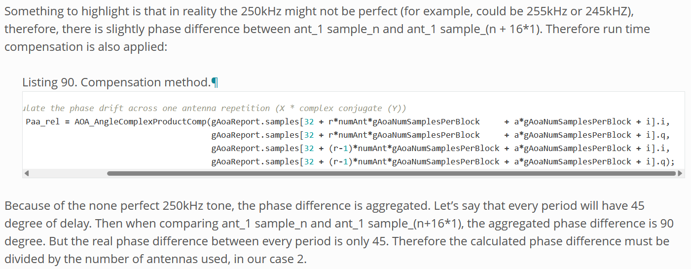

# 德州仪器关于蓝牙AOA定位中对CTE信号的解析

## 项目配置
- MCU -- 德州仪器 CC2640r2
- 主频 -- 48Mhz
- 蓝牙信号频率 -- 2.4Ghz
- CTE信号 -- 没有经过调制的250Khz的无线信号
- 采样率 -- 4Mhz

### 一、整个项目基于ti-rtos构建
略

### 二、从蓝牙数据包物理的传到天线矩阵上开始,各个重要事件的发生及其时间间隙

#### 1. 蓝牙数据包物理的传到天线矩阵  
- 时间点: 0 µs

#### 2. RF 核心检测到 CTE 信号并触发事件(RFC_IN_EV4)
- 时间点: 3.25 µs
- 此时得到CTE信号的持续事件等数据, 为了统一, 默认将tag发送CTE信号的持续时间设置为最大(160 µs)  

图一  蓝牙数据包链路层解析

#### 3. 启动定时器计时
- 时间点: 3.25 µs
- 此时`arr`的值为36 即0.75s触发定时器中断

---
    其实最主要的天线切换部分并没有完全看懂, ti采用的并非我们想要的以及目前已经商业化的方案  
    ti有关蓝牙AOA定位的说明甚至用户问答都是5年前了(2019年发布蓝牙5.1标准)
    下文仅给出一个符合其思想的合理的天线切换解决方案
---

#### 4. 定时器中断触发 
- 时间点: 4 µs (3.25 + 0.75)
- 天线进行切换
    - 采取TIM+DMA+GPIO的方式控制射频开关实现天线切换
- 设置`arr`为192 (4 µs 触发一次中断)

- 射频开关切换时隙为 1µs 或者 2µs 具体取决于射频开关的特性(价格) 故此时不能触发采样, 要有一个保护时间确保天线稳定
- 保护时间设置为 2 µs

#### 5. 保护时间结束
- 时间点: 6 µs
- 触发采样

#### 6. 第一根天线结束采样, 射频开关切换天线
- 时间点: 8 µs
- 在4Mhz的采样率下 2 µs 可以采到8个样品点
- 射频开关切换天线

#### 7. 保护时间结束
- 时间点: 10 µs
- 触发采样

#### 8. 第二根天线结束采样, 射频开关切换天线
- 时间点: 12 µs
- 在4Mhz的采样率下 2 µs 可以采到8个样品点
- 射频开关切换天线

---
    · · · · · ·轮询所有天线
---

#### 9. 天线轮询结束
- 时间点 ?
- 这个地方我也不会, 已知无线电 RAM 最多只能存储 512 个 I/Q 对
 一旦 radio core 填满了 I/Q 存储区域的 radio RAM, 它将停止 I/Q 采样
- 所以有两个方案 这两个方案都是可行的(吧?)
(1) 等天线轮询结束就关闭定时器
(2) 等IQ数据填满 RAM 在关闭采样, 关闭定时器
设置定时器的`arr`为36 即0.75s触发定时器中断 等待下一次事件触发

---
---

### 三、 总结?

为什么在采样时定时器的触发事件是 4 µs(及其倍数)?  
因为我们想要测得同一时间的IQ数据, 但是同一时间显然不能测量不同天线的采样数据  
而 4 µs 是250Khz的CTE信号的周期, 不同周期的IQ数据是相同的, 因此将采样间隔设置为 4 µs就能满足需求

事实上, CTE信号的频率并非稳定的250Khz, 在算法中, 我们需要做补偿

图二 德州仪器RTLS实验室关于CTE频率补偿的说明

除此之外, 由于实际数据与理想数据的差异, 在很多地方都要进行滤波和补偿. 

### reference:
Welcome to the Angle of Arrival BoosterPack  
Bluetooth® 到达角 (AoA) 天线设计  
RTLS Toolbox — SimpleLink™ CC2640R2 SDK User's Guide for BLE-Stack 3.x.x 3.03.01.00 documentation  
CC2640r2 SDK  
都能在文件中找到本地资料 

--- 
特别鸣谢 chatgpt  deepseek

